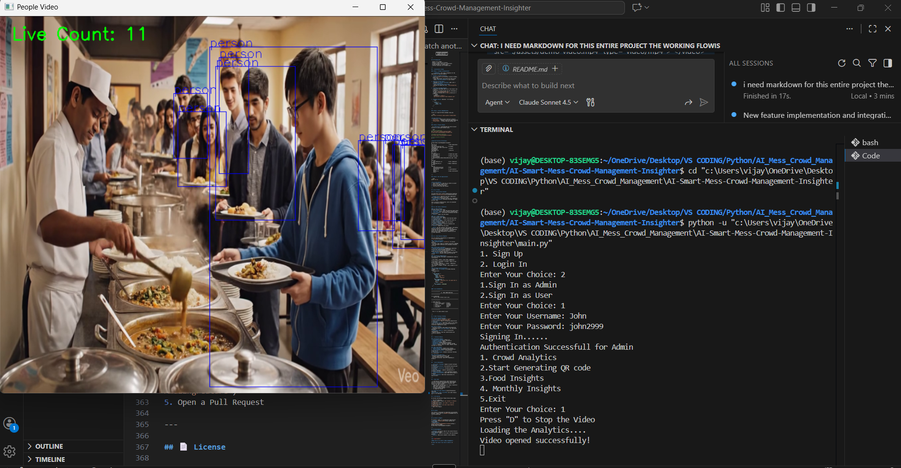

# 🍽️ AI Smart Mess Crowd Management Insighter

An intelligent crowd analytics system designed to monitor and manage dining hall queues in real-time using YOLOv8 object detection and Firebase integration. This solution helps students and mess administrators make informed decisions about optimal dining times.

---

## 📋 Table of Contents
- [Features](#-features)
- [System Architecture](#-system-architecture)
- [Prerequisites](#-prerequisites)
- [Installation & Setup](#-installation--setup)
  - [Step 1: Firebase Configuration](#step-1-firebase-configuration)
  - [Step 2: Install Dependencies](#step-2-install-dependencies)
  - [Step 3: Project Setup](#step-3-project-setup)
  - [Step 4: Run the Application](#step-4-run-the-application)
- [How It Works](#-how-it-works)
- [User Roles & Features](#-user-roles--features)
- [Technical Details](#-technical-details)
- [Future Enhancements](#-future-enhancements)
- [Demo Video](#-demo-video)
- [Contributing](#-contributing)
- [License](#-license)

---

## ✨ Features

- **Real-time Crowd Detection**: YOLOv8-powered person detection with live queue counting
- **Smart Suggestions**: AI-driven recommendations based on crowd density
- **Firebase Integration**: Real-time database updates every 5 seconds
- **Role-based Access**: Separate interfaces for Admin and User roles
- **Masked Zone Detection**: Intelligent filtering to exclude service staff from counts
- **Live Analytics Dashboard**: Terminal-based real-time statistics display
- **Peak Tracking**: Monitors and records maximum crowd density
- **Status Classification**: Three-tier crowd status (Available/Moderate/Crowded)

---

## 🏗️ System Architecture

```
┌─────────────────────────────────────────────────────────────┐
│                    User Authentication                       │
│              (authentication.py - SignIn/SignUp)            │
└────────────────────┬────────────────────────────────────────┘
                     │
         ┌───────────┴───────────┐
         │                       │
    ┌────▼─────┐           ┌────▼─────┐
    │  Admin   │           │   User   │
    │  Portal  │           │  Portal  │
    └────┬─────┘           └────┬─────┘
         │                       │
         └───────────┬───────────┘
                     │
         ┌───────────▼────────────┐
         │  Crowd Analytics       │
         │  (crowd.py)            │
         │  - YOLOv8 Detection    │
         │  - Queue Counting      │
         │  - Masked Zone Filter  │
         └───────────┬────────────┘
                     │
         ┌───────────▼────────────┐
         │  Firebase Realtime DB  │
         │  (Updates every 5s)    │
         └────────────────────────┘
```

---

## 🔧 Prerequisites

- Python 3.8 or higher
- Webcam or video file for testing
- Firebase account (free tier is sufficient)
- Minimum 4GB RAM (for YOLOv8 model)
- Internet connection (for Firebase sync)

---

## 🚀 Installation & Setup

### **Step 1: Firebase Configuration**

> ⚠️ **IMPORTANT**: This step is mandatory for the application to function properly.

1. **Create a Firebase Project**:
   - Go to [Firebase Console](https://console.firebase.google.com/)
   - Click "Add Project" and follow the setup wizard
   - Enable **Realtime Database** in your project

2. **Generate Private Key**:
   - Navigate to **Project Settings** (gear icon) → **Service Accounts**
   - Click **Generate New Private Key**
   - Download the JSON file (e.g., `newrulesimportant.json`)

3. **Configure the Application**:
   - Place the downloaded JSON file in the project root directory
   - Ensure the filename matches the one referenced in the code: `newrulesimportant.json`
   - Update the database URL in [main.py](main.py) if different:
     ```python
     database_url = "https://your-project-id-default-rtdb.firebaseio.com/"
     ```

4. **Database Rules** (Optional - for testing):
   ```json
   {
     "rules": {
       ".read": true,
       ".write": true
     }
   }
   ```

---

### **Step 2: Install Dependencies**

Install all required Python packages using pip:

```bash
pip install ultralytics opencv-python firebase-admin
```

**Package Details**:
- `ultralytics` - YOLOv8 object detection framework
- `opencv-python` - Computer vision and video processing
- `firebase-admin` - Firebase Realtime Database SDK

---

### **Step 3: Project Setup**

> 📁 **Important**: Clone/download the entire project directory to avoid path-related issues.

```bash
# Clone the repository
git clone https://github.com/Vijay-112007/AI-Smart-Mess-Crowd-Management-Insighter.git

# Navigate to project directory
cd AI-Smart-Mess-Crowd-Management-Insighter

# Verify directory structure
ls -la
```

**Expected Directory Structure**:
```
AI-Smart-Mess-Crowd-Management-Insighter/
│
├── main.py                          # Main application entry point
├── newrulesimportant.json          # Firebase credentials (you need to add this)
├── README.md                        # Project documentation
├── SECURITY.md                      # Security guidelines
│
├── assets/
│   ├── yolov8n.pt                  # YOLOv8 nano model (lightweight)
│   ├── yolov8l.pt                  # YOLOv8 large model (higher accuracy)
│   └── Dining_Hall_Queue_Video_Generation.mp4  # Demo video
│
├── data/
│   ├── credentials.csv             # User credentials database
│   └── admincred.csv              # Admin credentials database
│
└── src/
    ├── authentication.py           # User authentication module
    ├── crowd.py                    # Crowd analytics engine
    └── mail.py                     # Email notification module
```

---

### **Step 4: Run the Application**

```bash
python main.py
```

**First-time Setup**:
1. Choose option **1** (Sign Up) to create an account
2. Select user type (Admin or User)
3. Provide credentials and email
4. Follow the on-screen menu options

---

## 🔄 How It Works

### **1. Authentication System**

The application uses a secure authentication mechanism defined in [authentication.py](src/authentication.py):

- **SignUp Class**: Registers new users (Admin/User) with credentials stored in CSV files
- **SignIn Class**: Validates existing user credentials
- **Role-based Access**: Different privileges for Admin and User roles

After successful authentication, users are presented with role-specific options.

---

### **2. User Roles & Features**

#### 👤 **User Portal**
Available options after login:
1. **Crowd Analytics** - View real-time mess queue status
2. **Scan QR** - Quick check-in feature *(Coming Soon)*
3. **Food Insights** - Nutritional information and menu *(Coming Soon)*
4. **Exit** - Logout from the system

#### 👨‍💼 **Admin Portal**
Available options after login:
1. **Crowd Analytics** - Monitor real-time mess queue with detailed stats
2. **Generate QR Code** - Create unique QR codes for students *(Coming Soon)*
3. **Food Insights** - Manage menu and dietary information *(Coming Soon)*
4. **Monthly Insights** - Analytics dashboard and reports *(Coming Soon)*
5. **Exit** - Logout from the system

> **Note**: QR code scanning, food insights, and monthly analytics features are fully developed but not integrated into this repository due to code dependency issues with the deployment pipeline. A complete demonstration video showcasing all features will be provided separately.

---

### **3. Crowd Analytics Engine**

The core analytics functionality is implemented in [crowd.py](src/crowd.py):

#### **Video Processing**:
- Uses **YOLOv8n model** (`yolov8n.pt`) for person detection
- Processes video frames at standard resolution (720x640)
- Real-time object detection with confidence threshold filtering

#### **Intelligent Counting**:
- **Masked Zone Detection**: Automatically identifies service area (using bowl/spoon detection)
- **Staff Exclusion**: Service personnel behind the masked zone are excluded from counts
- **Live Count**: Current number of people in the queue
- **Peak Count**: Maximum crowd density during the session

#### **AI-Powered Suggestions**:
The system provides intelligent recommendations based on crowd density:

| Count Range | Status | Color Code | Suggestion |
|------------|--------|-----------|------------|
| 0-10 people | Available | 🟢 Green | "Mess is free! Perfect time to eat." |
| 11-20 people | Moderate | 🟠 Orange | "Moderately full. You might have to wait." |
| 20+ people | Crowded | 🔴 Red | "Very Crowded! Do not enter." |

#### **Firebase Synchronization**:
- Updates every **5 seconds** to Firebase Realtime Database
- Data structure:
  ```json
  {
    "Mess-System": {
      "hall-1": {
        "name": "Main Mess",
        "count": 15,
        "status": "Moderate"
      },
      "best_suggestion": {
        "message": "Moderately full. You might have to wait.",
        "color": "orange"
      },
      "last_updated": 1704825600
    }
  }
  ```

#### **Live Dashboard**:
```
---------------------------------------------------------------------------
                    🍽️  MESS CROWD ANALYTICS
---------------------------------------------------------------------------

🤖 AI SUGGESTION:
     Mess is free! Perfect time to eat.

---------------------------------------------------------------------------

📊 CROWD ANALYTICS:
     |_ Current Count (Live):  8 people
     |_ Total Count (Peak):     12 people
     |_ Status:                 Available
     |_ Last Updated:           14:32:15
     |_ Intensity:              green

---------------------------------------------------------------------------

  Press 'd' on video window to quit
```

---

## 🎥 Video Training & Testing

### **Current Implementation**:
- **Training Video**: Located in `assets/Dining_Hall_Queue_Video_Generation.mp4`
- **Demo Purpose**: Used for testing and demonstration at hackathons
- **Orientation Note**: Additional videos in the assets folder are available but not currently used due to orientation compatibility issues

### **Future Scope**:
- Training on multiple video angles and perspectives
- Integration with **live CCTV feeds** for real-world deployment
- **Multi-hall support**: Track 2+ dining halls simultaneously
- Temporal analysis: Peak hour identification and predictive analytics

---

## 🛠️ Technical Details

### **Technology Stack**:
- **Programming Language**: Python 3.8+
- **Computer Vision**: YOLOv8 (Ultralytics)
- **Video Processing**: OpenCV
- **Database**: Firebase Realtime Database
- **Authentication**: CSV-based credential storage
- **Model**: YOLOv8n (nano) for speed, YOLOv8l (large) available for accuracy

### **Key Algorithms**:
1. **Object Detection**: YOLOv8 neural network
2. **Zone Masking**: Bounding box overlap detection
3. **Crowd Classification**: Threshold-based categorization
4. **Frame Processing**: Standard resolution resizing for consistency

### **Performance Metrics**:
- Detection confidence threshold: >10%
- Firebase update interval: 5 seconds
- Real-time processing: ~20-30 FPS (depending on hardware)

---

## 🚀 Future Enhancements

1. **Multi-Hall Tracking**: Expand to monitor multiple dining areas
2. **Mobile Application**: Cross-platform app with push notifications
3. **Predictive Analytics**: ML-based peak hour forecasting
4. **QR Integration**: Complete implementation of attendance tracking
5. **Food Waste Analysis**: Track consumption patterns
6. **Energy Optimization**: Smart HVAC control based on occupancy
7. **Web Dashboard**: Real-time visualization for administrators

---

## 🎬 Demo Video

> A comprehensive demonstration video showcasing all features including QR code generation, food insights, and monthly analytics dashboard is available upon request. The video includes:
> - Complete user journey (Sign up → Login → Analytics)
> - Admin panel functionality
> - Real-time crowd detection in action
> - Firebase database updates
> - AI suggestion system

**[📺 Watch Full Demo Video]**
***(./assets/Presentation Video.mp4)***
***(Download the Raw File in order to get as MP4 file or else open with MP4)***
**Watch another video in the PPT** (for other feature which is not deployed)

*Figure: Real-time crowd analytics dashboard*
---

## 🤝 Contributing

We welcome contributions! Please follow these steps:

1. Fork the repository
2. Create a feature branch (`git checkout -b feature/AmazingFeature`)
3. Commit your changes (`git commit -m 'Add some AmazingFeature'`)
4. Push to the branch (`git push origin feature/AmazingFeature`)
5. Open a Pull Request

---

## 📄 License

This project is developed for educational and hackathon purposes. Please refer to [SECURITY.md](SECURITY.md) for security guidelines.

---

## 📧 Contact & Support

For queries, issues, or collaboration opportunities:
- **GitHub**: [@Vijay-112007](https://github.com/Vijay-112007)
- **Repository**: [AI-Smart-Mess-Crowd-Management-Insighter](https://github.com/Vijay-112007/AI-Smart-Mess-Crowd-Management-Insighter)

---

## 🙏 Acknowledgments

- **YOLOv8**: Ultralytics team for the state-of-the-art object detection model
- **Firebase**: Google for the robust real-time database platform
- **OpenCV**: Open-source computer vision community

---

<div align="center">

**Made with ❤️ for smarter campus management**

⭐ **Star this repo if you find it useful!** ⭐

</div>

<p>This is our First Hackathon Project, we don't know any instructions or guidance to do. Learnt lot of things from our mistakes and really enjoyed and vibed during the code development . Thanking the GDG for giving this opportunity and brought such a friendly hackathon.
</p>
